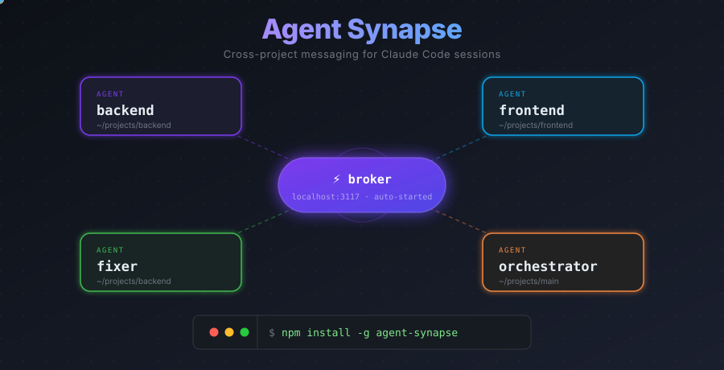

# Agent Synapse

[](https://www.npmjs.com/package/agent-synapse)
[](LICENSE)



Cross-project messaging between Claude Code sessions via named agents.

Agent Synapse lets multiple Claude Code sessions talk to each other — even across different project folders. Each session gets a codename. Agents send messages to each other by name, check their inbox, and see who's online.

```
Terminal 1 (~/backend)              Terminal 2 (~/frontend)
┌──────────────────┐                ┌──────────────────┐
│ Agent: "backend"  │   send_message │ Agent: "frontend" │
│                   │ ──────────────>│                   │
│ Claude Code       │    (broker)    │ Claude Code       │
└──────────────────┘                └──────────────────┘
         │                                   │
         └──────── Synapse Broker ───────────┘
              (localhost:3117, auto-started)
```

## What can I build with this?

- **Cross-project handoffs** — a frontend agent asks its orchestrator for API details; the orchestrator messages the backend orchestrator, who routes to the right agent and sends back the answer
- **Specialist teams** — a builder agent implements, a fixer agent patches bugs, an orchestrator coordinates — each with its own focused context
- **Any multi-step workflow** — set up agents with specific roles and pass context from one to the next, no copying and pasting between terminals

## Requirements

- Node.js >= 18
- Claude Code (with a claude.ai account — API key auth is not supported)

## Quickstart

```bash
# Install
npm install -g agent-synapse

# One-time setup (registers MCP server, installs hook, configures status line)
agent-synapse setup
```

Then open two terminals:

```bash
# Terminal 1
SYNAPSE_AGENT_NAME=backend claude

# Terminal 2
SYNAPSE_AGENT_NAME=frontend claude
```

The broker starts automatically when the first agent connects.

In Terminal 1, say: *"Send frontend a message: the API is ready at POST /api/meetings"*

Terminal 2 will pick it up after the next tool use.

### Real-time push (optional)

Standard mode works great on its own — messages are checked after every tool use. If you want instant delivery without any delay, add the channels flag:

```bash
SYNAPSE_AGENT_NAME=backend claude --dangerously-load-development-channels server:synapse
```

This enables Claude Code's Channels API for real-time push. The flag sounds alarming but everything runs locally — it just bypasses Anthropic's allowlist while Synapse is in development. It will go away once Synapse is published as an approved plugin.

## Creating Agents

For reusable, long-lived agents you can create a persistent agent with its own `CLAUDE.md`. This lets you open the agent by simply running `claude` from its folder — no env var needed.

### From inside a Claude session

If you're already in Claude and want to create a new agent on the fly:

> *"Create an agent called data-pipeline that handles ETL jobs and knows about our Postgres schema"*

This calls the `create_agent` tool, which creates `agents/data-pipeline/CLAUDE.md` in your current project and prints the command to open it.

### From the terminal

```bash
# In your project directory
agent-synapse create-agent data-pipeline "Handles ETL jobs and knows about our Postgres schema"
```

Both approaches create:

```
your-project/
└── agents/
    └── data-pipeline/
        └── CLAUDE.md      ← identity + Synapse self-registration instruction
```

The agent registers itself automatically when the session starts — no extra steps.

To start the agent:

```bash
cd agents/data-pipeline && claude
```

## Agent Naming

Three ways to set the agent name, in order of precedence:

**1. Environment variable** — most explicit, set before launching Claude:
```bash
SYNAPSE_AGENT_NAME=backend claude
```

**2. Self-registration via CLAUDE.md** — for created agents, the `CLAUDE.md` instructs the agent to register itself at session start. The status line updates once registration completes.

**3. Folder name fallback** — if neither of the above is set, defaults to the current folder name (e.g. `~/projects/backend` becomes `backend`).

## Tools

Once connected, Claude has these tools:

| Tool | Description |
|------|-------------|
| `send_message` | Send a message to another agent by name |
| `check_messages` | Check your inbox for messages from other agents |
| `list_agents` | See all registered agents and their status |
| `register_agent` | Set or change the agent name for this session |
| `rename_agent` | Rename this session's agent, migrating its identity and any pending messages |
| `unregister_agent` | Remove this session's registration so it stops receiving messages |
| `create_agent` | Create a new agent with a `CLAUDE.md` in the current project |

## CLI

```bash
agent-synapse setup                            # Configure Synapse (run once)
agent-synapse create-agent <name> [desc]       # Create a new agent in ./agents/<name>/
agent-synapse broker start                     # Start broker manually (usually auto-started)
agent-synapse broker stop                      # Stop the broker
agent-synapse broker status                    # Show broker and connected agents
agent-synapse uninstall                        # Remove Synapse from Claude Code settings
agent-synapse version                          # Show version
```

## How It Works

Synapse supports two delivery modes:

**Standard mode** (no flag needed):
1. Agent A sends a message to Agent B via the `send_message` tool
2. The broker queues the message
3. After Agent B's next tool use, a PostToolUse hook checks for pending messages
4. Claude sees the notification and calls `check_messages` to retrieve them

**Channel mode** (with `--dangerously-load-development-channels`):
1. Agent A sends a message to Agent B via the `send_message` tool
2. The broker pushes it instantly via SSE
3. The message appears in Agent B's context as a `<channel>` tag — no polling needed

In both modes, if the target agent is offline, messages are queued to disk and delivered on reconnect.

## What `setup` does

Running `agent-synapse setup` configures three things:

1. **MCP server** — Registers Synapse globally in `~/.claude.json` so the tools are available in every Claude Code session
2. **Hooks** — Adds PostToolUse and UserPromptSubmit hooks to `~/.claude/settings.json` that check for pending messages and nudge Claude to read them
3. **Status line** — Wraps your existing status line to show the agent name and pending message count (e.g. `backend [synapse: backend (3)]`)

## Architecture

**Broker** — Lightweight HTTP server on `localhost:3117`
- Routes messages between agents via SSE (channel mode) or queue polling (standard mode)
- Persists undelivered messages to disk (`~/.claude-synapse/queues.jsonl`)
- Zero external dependencies (Node.js stdlib only)

**MCP Server** — Registered globally, spawned per Claude Code session
- Provides `send_message`, `check_messages`, `list_agents`, `register_agent`, `rename_agent`, `unregister_agent`, and `create_agent` tools
- Auto-starts the broker if it's not running
- Writes a session file (`~/.claude-synapse/session-<ppid>.name`) when an agent registers so the status line can show the name even without `SYNAPSE_AGENT_NAME` being set

## Security

- Broker binds to `127.0.0.1` only — not exposed to your network
- All requests require an auth token generated during setup
- Data directory and file permissions are locked down (`700` / `600`)
- Max message size: 100KB, max queue depth: 100 messages per agent

**One thing to keep in mind:** messages from other agents enter Claude's context. Don't pass secrets or credentials through Synapse — treat agent messages like any other external input.

## License

MIT
